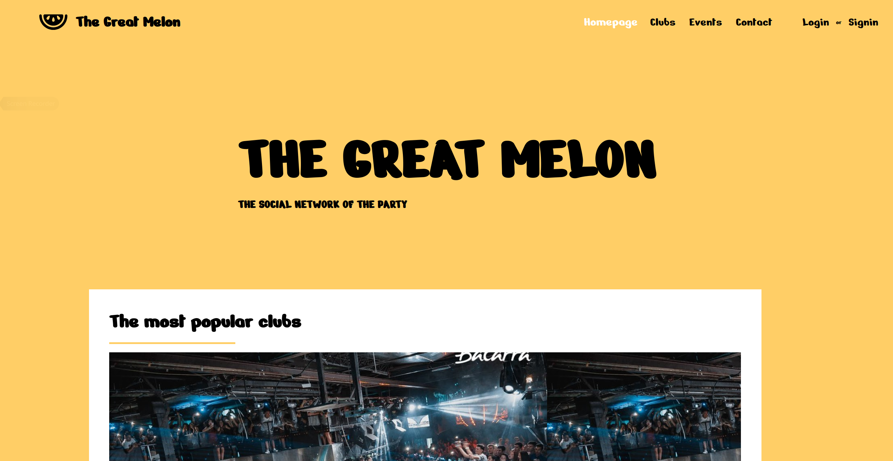
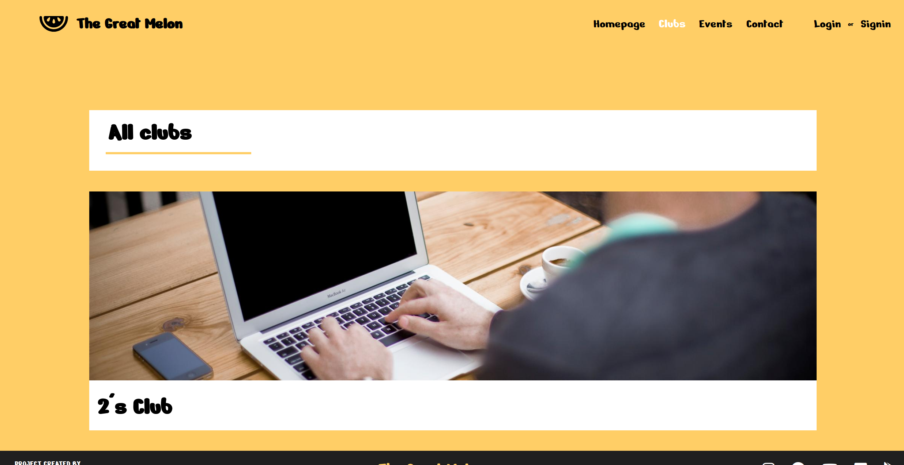
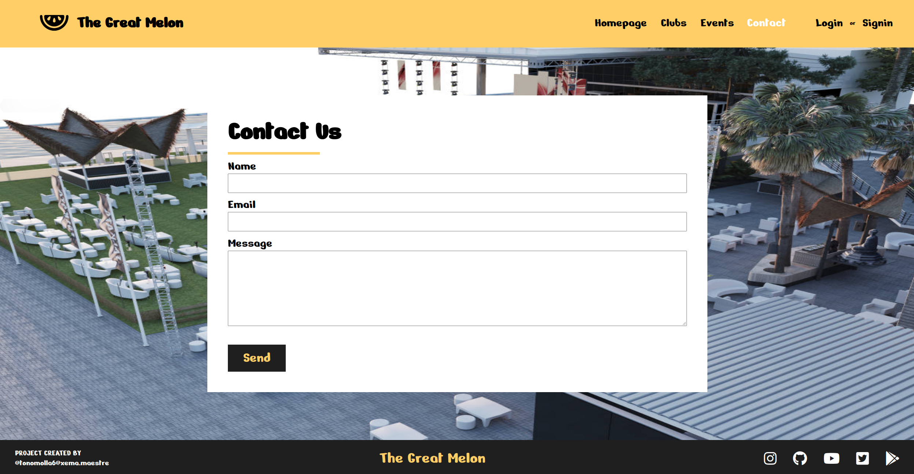
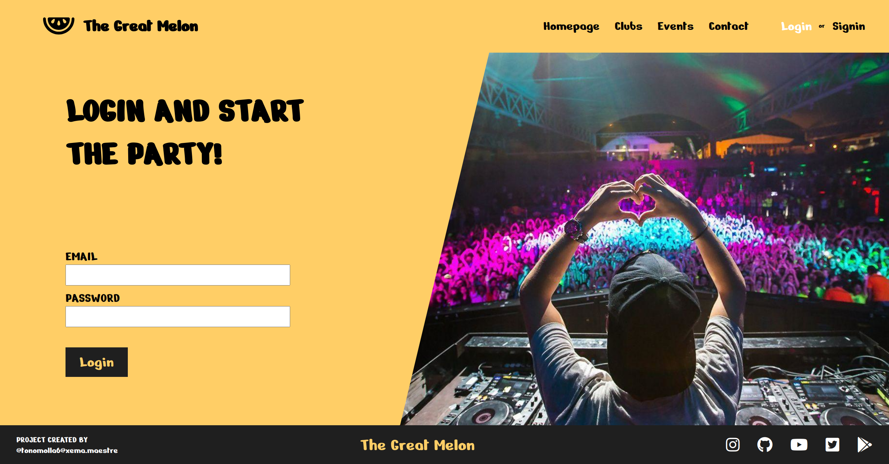
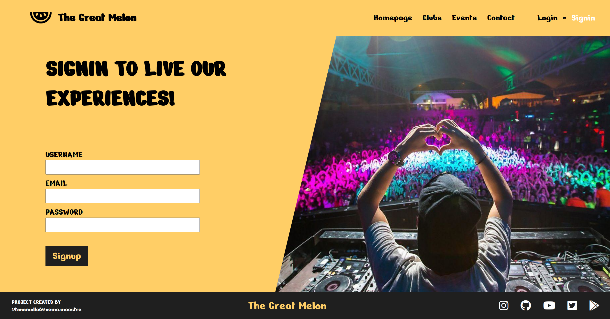
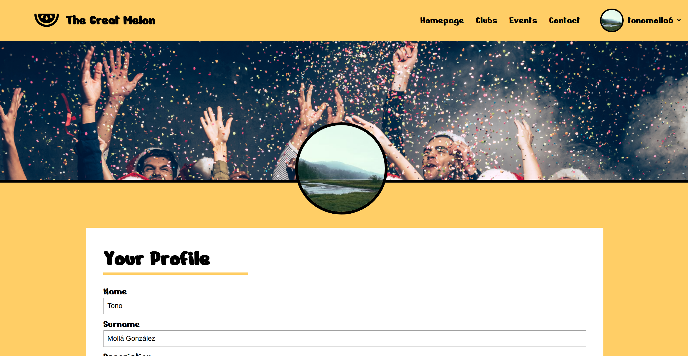
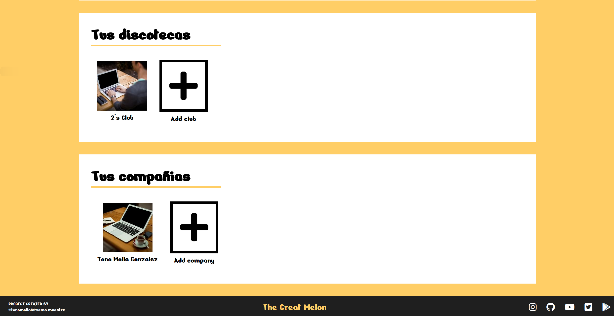
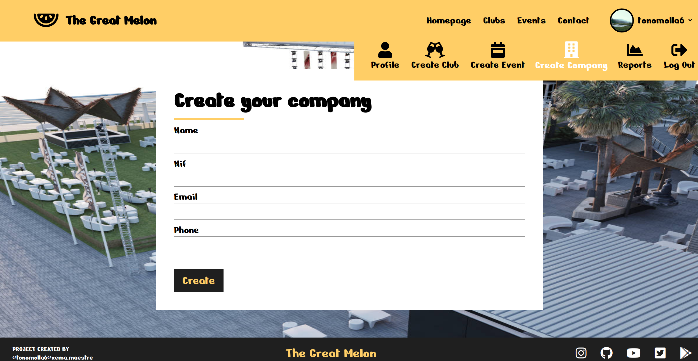

# THE GREAT MELON


## Cómo funciona? 📖

¡Entérate de todas las fiestas que te rodean en esta aplicación!
También puede crear sus propias fiestas y publicarlas.
Proyecto creado con angular, laravel y go con microservicios.












## Comenzando 🚀

_Descarga el repositorio de github_

```
git clone https://github.com/tonomolla6/testAngular-Laravel-Go.git
```


## Pre-requisitos 📋

Para lanzar esta apliacion necesitamos instalar lo siguiente:

## Docker
```
sudo apt update
```
```
sudo apt install apt-transport-https ca-certificates curl software-properties-common
curl -fsSL https://download.docker.com/linux/ubuntu/gpg | sudo apt-key add -
sudo add-apt-repository "deb [arch=amd64] https://download.docker.com/linux/ubuntu bionic stable"
sudo apt update
apt-cache policy docker-ce
sudo apt install docker-ce
```


## Docker compose

```
sudo curl -L "https://github.com/docker/compose/releases/download/1.26.0/docker-compose-$(uname -s)-$(uname -m)" -o /usr/local/bin/docker-compose
sudo chmod +x /usr/local/bin/docker-compose
```

_Comprobamos que está instalado_
```
docker-compose --version
```

## PHP
sudo apt-get install apache2 php7.3 libapache2-mod-php7.3

sudo apt-get install php-gd php-xml php7.2-mbstring

sudo apt-get install php7.2-xml


## Activar apache con php
a2query -m php7.3

sudo a2enmod php7.3

sudo service apache2 restart


## Instalar Postgres
sudo apt install postgresql postgresql-contrib

sudo -u postgres psql -c "SELECT version();"

## Postgres con php
apt-get install php-pgsql


# Lanzar aplicación 🚀

_Nos situamos en el repositorio previamente descargado_


## Backend

```
cd backend
```
```
sudo docker-compose up
```

## Frontend

```
cd frontend/angular
```
```
npm start
```

_Una vez realizados los pasos anteriores nos dirigimos a_

```
localhost:4200
```


## Instlar pgadmin4 (Debian 10)
apt-get install curl ca-certificates gnupg
curl https://www.postgresql.org/media/keys/ACCC4CF8.asc | apt-key add -

echo "deb http://apt.postgresql.org/pub/repos/apt/ buster-pgdg main" > /etc/apt/sources.list.d/pgdg.list

apt-get update
apt-get install pgadmin4  pgadmin4-apache2

## Instlar pgadmin4 (Ubuntu 20)
curl https://www.pgadmin.org/static/packages_pgadmin_org.pub | sudo apt-key add
sudo sh -c 'echo "deb https://ftp.postgresql.org/pub/pgadmin/pgadmin4/apt/$(lsb_release -cs) pgadmin4 main" > /etc/apt sources.list.d/pgadmin4.list && apt update'

sudo apt install pgadmin4


## Cosas que hemos hecho

- Home, Shop Go: list/details
    - Home en angular y go
    -> FALTA EL SHOP
      
- PanelAdmin Laravel: CRUD.
    - Crear companies asociadas al usuario

- Login, register, JWT.
    - Laravel: Login y register
    - Go: Login y register

- Login_admin.
    - LOGIN EN LARAVEL SOLO SI ES ADMINISTRADOR

- microservices.
    - Entradas, Discotecas, Events, Users y Profiles.

- Relationships Go/Laravel.
    - Laravel: Usuarios a compañias.
    - Go: M - M, Users - Favoritos

- Home/Shop Go: users més populars, articles més comprats, ... PanelAdmin Laravel: dashboard amb estadístiques.
    - Go: discotecas mas visitadas, 
    - Go: DISCOTECAS MAS POPULARES, EVENTOS CON MAS VENTAS
    - Laravel: DASHBOARD CON ESTADISTICAS DE REDIS.
    
- Profile:
    - List your profile
    - Update your profile
    - List your discos
    - Mejora de seguridad, doble comprobacion del id del usuario al hacer get de sus discotecas, tiene que recibir bearer y el id del user

- Readme.
    - hecho.

Improvents:
    1. Collection en postman con todas las apis disponibles del backend (Exportadas en el repositorio de github)
    2. Validacion de go y laravel en el register, contraseña mas de 6 digitos, correo valido...
    3. Utilizacion de validaciones en crud de usuario y request en laravel
    4. Serializers de go para formatear los datos de la base de datos.
    5. Mejoras de seguridad admin, no se puede hacer sesion en laravel si no se ha iniciado sesion posteriormente en go
    6. Middlewares de seguridad en laravel para la validacion de JWT
    7. Seeders de usuarios en Laravel.
    8. Toastr Angular. 
    9. Nivells de seguretat microservices middleware_auth.
    10. Relationships Go/Laravel: traits, emitters, related, association, ...
slug, author, tags, pager, favorites, follow, comments, buys, ...
    11. seed_Go/Laravel.
    12. validate register BE Go.
    13. Middleware propio de CORS para laravel.
    14. Utilización de proxy en angular.
    15. Login administrador con doble token para laravel y go.
    16. Componentes de angular que se ven depende del tipo del usuario logeado.
    17. Que tanto el administrador como el cliente puedan borrar sus discotecas.
    18. Utilización de todos los tipos mas populares de llamadas api rest en laravel.


PROJECT CREATED BY
@xema.maestre
@tonomolla6