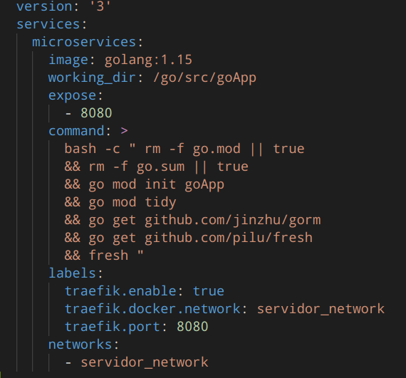

# Práctica Mejora Proyecto Servidor

# Introducción
 
## ¿QUE ES GO?
Go es la tecnología que hemos utilizado para hacer la práctica, es un lenguaje de programación concurrente y compilado, desarrollado por los ingenieros de Google, es un lenguaje maduro, con el cual se han desarrollado miles de proyectos alrededor del mundo, incluso, versiones actuales de Go están escritas con el mismo Go, su lanzamiento oficial fue a finales de 2009 (aunque su primera versión estable fue en 2012), está basado principalmente en C, incluso se denomina que go es el sustituto de C.

Go usa tipado estático y es tan eficiente como C. Está pensado para facilitar la vida al máximo a los programadores. Permite detectar errores en la sintaxis durante la compilación y no durante la ejecución, a diferencia de otros lenguajes compilados.

En conclusión es un lenguaje de programación muy ligero y eficiente superior a C.

# Refactorizar la aplicación

## Objetivo

Una de las ventajas que nos dan los modulos de go (go modules) es el adiós a las variables de entorno GOPATH, podemos iniciar nuestro proyecto en go desde el directorio que queramos, lo que nos aporta una gran sencillez a la hora de dockerizar la aplicación.

## Como iniciar

Por defecto Go Modules no viene activado para ser usado en GOPATH, pero si queremos utilizarlo será tan sencillo como activar la variable de entorno que nos ofrecen.

``` sh
$ echo "export GO111MODULE=on" >> ~/.bash_profile
```
``` sh
$ source ~/.bash_profile
```

Con esto, ya tendríamos go modules activado

## Crear un modulo

Para crear un go module independiente del resto, nos situamos en el directorio de nuestra aplicación, y crearemos una carpeta con el nombre del módulo que deseamos, en este caso, se llamará “events” .

Nos situamos en la carpeta events y ejecutamos: 

``` sh
$ go mod init goApp_events
```


Estro nos creará un fichero llamado go.mod, en el cual no tendremos que tocar mucho


Una vez hemos inicializado Go Modules en nuestro proyecto, podemos descargar las dependencias del mismo, esto servirá tanto para la primera vez como para cada vez que añadamos una nueva dependencia.

``` sh
$ go mod tidy
```

_Go mod tidy incluye en nuestro go.mod todas las dependencias necesarias para nuestros tests, de manera que si un test falla, sabremos cual es la dependencia que utiliza para reproducir el error._


Ya podemos continuar con la creación del módulo, para ellos empezaremos por el main.go, dentro de la carpeta “events”


El codigo de main.go se puede ver en el repositorio de github asociado en https://github.com/Tonomolla6/testAngular-Laravel-Go/tree/develop


Creamos la carpeta common, que como bien indica el nombre, será una carpeta común en cada módulo de nuestra aplicación, de esta manera nos aseguramos de que si, por casualidades de la vida un módulo cae, no afectaría a los demás módulos y podría seguir funcionando la aplicación


Creamos la carpeta “src” donde estarán los archivos relacionados con nuestro módulo events y sus dependencias


Una vez hecho el paso anterior volvemos a hacer go mod tidy para que instale las dependencias automáticamente, las añada al go.mod (por eso hemos dicho antes que no hay que tocarlo) y borre las dependencias que no estamos usando (por ejemplo “fmt” que es para debuggear).


Nuestro go.mod quedaría de la siguiente manera:


Y nuestro go.sum se creará automáticamente con todas las dependencias que necesitamos en nuestro package “events”


Y ya tendríamos nuestro modulo en go activo y listo.


# Microservicios
## Introducción

_Los microservicios son, explicado de una manera cotidiana, un backend para cada uno de los modelos de nuestra app, en el que cada uno funciona por un o unos puertos diferentes._

_Es decir, si antes teníamos un main.go que lanzaba todos nuestros modelos, ahora cada modelo tendrá su propio main.go con sus dependencias que serán independientes al resto de módulos._

_El beneficio que nos da esto es que cada uno irá por un puerto diferente y eso nos da una velocidad de acceso que no teníamos antes, y además podemos prevenir fallos ya que, si un microservicio cae, no afectaría al resto porque son independientes, al contrario que pasaba anteriormente._ 


## Iniciación

En el ejercicio de antes hemos refactorizado la app para poder usar módulos, y está preparada de una manera en la que ya podemos implementar microservicios al tener cada uno:

## Common

Una carpeta common con aspectos de configuración globales al microservicio así como utilidades para la creación de sesiones de base de datos


## Models

Un archivo models dentro de la carpeta src en donde se definirán los modelos utilizados por el microservicio


## Routers

Un archivo routers dentro también de la carpeta src para la definición de las rutas o endpoints que publicará el microservicio


## Data

Un archivo data (en este caso llamado resolvers) en donde se incluyen las funciones que son ejecutadas para obtener la información de respuesta de los endpoints del microservicio


## Docker-compose

Para poder lanzar los microservicios, es necesario dockerizar la aplicación y añadir los microservicios, para ellos, configuraremos nuestro .yml de la siguiente manera:

- Partiremos de una imagen golang:1.15
- El nombre del contenedor lo llamaremos go_events
- El directorio de trabajo será /go/src/goApp_events
- Tendrá un volumen asociado a la carpeta events que será goApp_events 
  ./go/events:/go/src/goApp_event  s


- Ejecutaremos los comandos necesarios para que funcione nuestro microservicio en go
- Exponemos el puerto 8080 común en todos los microservicios 


- Tendrá dependencias para los servicios de mysql y de redis
- Tendrá una network común, que en este caso será servidor_network


Configuraremos los servicios de mysql y de redis de la siguiente manera:


Repetir el proceso anterior para cada microservicio que queramos crear.

## Traefik

Al ser independientes los microservicios entre ellos mismos, necesitamos una herramienta que gestione los puertos asociados a cada microservicio, para ellos utilizaremos traefik

### Introducción

_Traefik es un proxy inverso y un balanceador HTTP y TCP escrito en GO que ofrece un conjunto de características muy interesantes:_ 
· Auto-descubrimiento de servicios
· Tracing
· Métricas
· Despliegues sobre un subconjunto de clientes
· Mirroring

_Además integra una completa UI que nos da información sobre todo lo que ofrece que veremos más adelante_
 
 
## Configuración
Creamos una carpeta llamada traefik con un archivo llamado acme.json dentro

 

- Partiremos de una imagen de traefik:v2.3
- Ejecutará los comandos reflejados en la imagen de abajo para su correcto funcionamiento
- Expondrá los puertos 80 y 8080 
- Compartirá la network “servidor_network”


- Tendrá un volumen asociado a /var/run/docker.sock:/var/run/docker.sock 
- El nombre del contenedor será traefik 
- Aplicaremos la opción de restart: always para que pueda ejecutar todos los microservicios por si alguno falla


Ya tenemos  nuestro servicio de traefik configurado.


Ahora, tenemos que ir a los microservicios que hemos creado antes en nuestro .yml y añadimos lo siguiente

- La primera opcion será para definir la ruta de acceso a este microservicio, en este caso será events.docker.localhost 
- La segunda opcion
- La tercera opcion será para definir la network compartida, que es servidor_network 
- La cuarta opción definimos el puerto asociado a traefik, por el cual partirán todos los microservicios, en este caso el puerto 8080


Repetimos el proceso anterior en cada uno de los microservicios que tengamos en nuestra app, en mi caso tengo “events”, “discotecas” y “users”, y quedaria de la siguiente manera

### Discotecas:


### Users:


### Events:


## Puertos

Evidentemente, cada microservicio será lanzado por el puerto 8080, que definimos en cada main.go de cada microservicio para que traefik se encargue de asignar un puerto.

```
r.Run(“:8080”)
```


Una vez completados todos los pasos, procedemos a lanzar los contenedores de nuestro .yml con

```
$ sudo docker compose up
```


## DashBoard

Una vez lanzados nuestros contenedores, accedemos al dashboard de traefik en el puerto 8080

```
localhost:8080
```


Hacemos click en HTTP y comprobamos nuestros servicios activos


Como podemos ver, todos nuestros servicios funcionan correctamente, y si hacemos click en alguno de ellos, en este caso el de events (4º posición) podremos ver la configuración del mismo y muchas más cosas, entre ellas, cómo acceder a este para realizar peticiones


Como podemos comprobar, para acceder a este microservicio tendremos que acceder a 

```
Host(`events.docker.localhost`)
```

Vamos a crear un event de prueba para verificar que funciona correctamente:


Accedemos a:

```
http://events.docker.localhost/api/events/ 
```

Y observamos el resultado


Como podemos ver, el microservicio de events gestionado por traefik funciona correctamente. 


# EXTENSIONES DOCKER

Vamos a crear una extension para los microservicios de go ya que estamos repitiendo codigo


Creamos un archivo llamado microservices-go.yml con el servicio "microservices"
``` yaml
version: '3'
services:
    microservices:
```
- Partiremos de una imagen golang:1.15
    ``` yaml
    image: golang:1.15
    ```
- El directorio de trabajo será /go/src/goApp 
    ``` yaml
    working_dir: /go/src/goApp
    ```
- Exponemos el puerto 8080 común en todos los microservicios
    ``` yaml
    expose:
        - 8080
    ```
- Añadimos los comandos necesarios para iniciar nuestro microservicio.
    ``` yaml
    command: >
        bash -c " rm -f go.mod || true
        && rm -f go.sum || true
        && go mod init goApp
        && go mod tidy
        && go get github.com/jinzhu/gorm
        && go get github.com/pilu/fresh
        && fresh "
    ```
- Tendrá una network común, que en este caso será servidor_network
    ``` yaml
    networks:
        - servidor_network
    ```
    

     
Una vez configurado el documento microservices-go.yml con todas las propiedades en comun que tendran los microservicios vamos a añadirlos a el documento docker-compose.yml

Creamos un microservicio con el nombre que queramos (en mi caso con el nombre del microservicio) y ponemos el nombre del archivo del cual extiende el servicio.
``` yml
discotecas:
    extends:
        file: microservices-go.yml
        service: microservices
```
- El nombre del contenedor lo llamaremos go_discotecas_container
    ``` yml
    container_name: go_discotecas_container
    ```
- Tendrá un volumen asociado a la carpeta events que será goApp
  ./go/events:/go/src/goApp
    ``` yml
    volumes:
        - ./go/discotecas:/go/src/goApp
    ```
- Tendrá dependencias para los servicios de mysql y de redis
    ``` yml
    depends_on:
        - mysql
        - redis
    ```
    


Comprobamos que los microservicios con las extensiones funcionan


# Prometheus y grafana con Traefik

Prometheus es un sistema de monitoreo de código abierto basado en métricas. Recopila datos de servicios y hosts mediante el envío de solicitudes HTTP en puntos finales de métricas. Luego, almacena los resultados en una base de datos de series de tiempo y los pone a disposición para análisis y alertas.

Grafana es una herramienta para visualizar datos de serie temporales. A partir de una serie de datos recolectados obtendremos un panorama gráfico de la situación de una empresa u organización. 

En el siguiente punto vamos a configurar traefik para que proporcione metricas de nuestros microservicios en go a prometheus y que grafana los monitorice. Vamos a empezar configurando traefik para que genere metricas que podamos utilizar.

## Traefik

Le añadimos por cli los siguientes comandos al docker-compose, el servicio traefik:

- Para habilitar las metricas de prometheus en traefik
    ``` yml
    "--metrics.prometheus=true"
    ```
- Buckets para métricas de latencia predeterminadas.
    ``` yml
    "--metrics.prometheus.buckets=0.100000, 0.300000, 1.200000, 5.000000"
    ```

El servicio de docker-compose debe de quedar asi finalmente:


## Prometheus

Vamos a añadir el servicio de prometheus al archivo docker-compose.yml
``` yml
prometheus:
```
- Partiremos de una imagen de prometheus version 2.20.1
    ``` yml
    image: prom/prometheus:v2.20.1
    ```
- Le asignamos el nombre de prometheus_container al servicio
    ``` yml
    container_name: prometheus_container
    ```
- Establecemos los puertos de la maquina real y del contenedor
    ``` yml
    ports:
        - 9090:9090
    ```
- Copiamos la configuracion de prometheus por medio de volumes y le decimos donde se encuentra
    ``` yml
    volumes:
        - ./prometheus.yml:/etc/prometheus/prometheus.yml
    command: 
        - "--config.file=/etc/prometheus/prometheus.yml"
    ```
    - Esta es la configuracion del archivo prometheus.yml
        ``` yml
        global:
            scrape_interval: 5s
            evaluation_interval: 30s
        scrape_configs:
            - job_name: "testAngular-Laravel-Go"
        static_configs:
            - targets: ["traefik:8080"]
        ```
- Lo asignamos a la red que hemos creado para la practica
    ``` yml
    networks:
        servidor_network:
    ```
- Le añadimos dependencias
    ``` yml
    depends_on: 
        - users
        - discotecas
        - events
    ```
- Y las etiquetas que utilizara traefik para identificar a prometheus
    ``` yml
    labels:
        traefik.backend: prometheus
        traefik.docker.network: servidor_network
        traefik.frontend.rule: Host:prometheus.localhost
        traefik.port: 9090
    ```
    
El servicio de docker-compose debe de quedar asi finalmente:


## Grafana

Finalmente añadimos el servicio de grafana para monitorizar las metricas.
``` yml
grafana:
```
- Partiremos de la version 7.1.5 de grafana
    ``` yml
    image: grafana/grafana:7.1.5
    ```
- Llamaremos grafana_container al servicio
    ``` yml
    container_name: grafana_container
    ```
- Configuramos los puertos de maquina real y virtual
    ``` yml
    ports:
        - "3500:3000"
    ```
- Añadimos la configuracion de grafana mediante volumes
    ``` yml
    volumes:
        - './grafana.yml:/etc/grafana/provisioning/datasources/datasources.yml'
        - 'grafana:/var/lib/grafana'
    ```
    - Esta es la configuracion del archivo grafana.yml
        ``` yml
        apiVersion: 1
        datasources:
          - name: Prometheus
            type: prometheus
            access: proxy
            orgId: 1
            url: prometheus_container:9090
            basicAuth: false
            isDefault: true
            editable: true
        ```
- Creamos las variantes para acceder como anonymous, activarlo...
    ``` yml
    environment:
        GF_INSTALL_PLUGINS: "grafana-clock-panel 1.0.1"
        GF_AUTH_ANONYMOUS_ENABLED: "true"
        GF_AUTH_DISABLE_LOGIN_FORM: "true"
        GF_AUTH_ANONYMOUS_ORG_ROLE: "Admin"
    ```
- Creamos dependencias
    ``` yml
    depends_on: 
        - prometheus
    ```
- Añadimos el servicio a la red que hemos creado para la practica
    ``` yml
    networks:
        - servidor_network
    ```
    
El servicio de docker-compose debe de quedar asi finalmente:


Iniciamos el archivo docker-compose.yml y comprobamos si todo funciona correctamente
``` sh
sudo docker-compose up
```


Una vez en funcionamiento los contenedores vamos a ver si traefik nos proporciona metricas en http://0.0.0.0:8080/metrics


Comprobamos que prometheus recibe las metricas de traefik en http://0.0.0.0:9090/targets


Finalmente vamos a configurar grafana para monitorizar las metricas de traefik con prometheus

- Abrimos la ruta http://0.0.0.0:3500
 


- Creamos un dashboard nuevo


- Añadimos un panel


- Seleccionamos querys prometheus


- Elegimos las metricas que queramos monitorizar


El dashboard quedaria asi


Esta practica esta realizada por:

https://github.com/tonomolla6

https://github.com/j-maestre